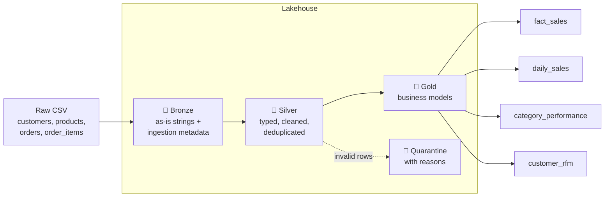

# 🏛️ PySpark Medallion Lakehouse


A retail data lakehouse built in PySpark using the **medallion architecture** (bronze → silver → gold).
It takes deliberately messy raw retail data and turns it into trusted tables for BI and analytics:
a sales fact table, daily KPIs, category performance, and customer RFM segments.
It runs on a laptop (Parquet) or on **Databricks with Delta Lake** without code changes.

## Architecture



| Layer | Responsibility | Key techniques |
|-------|----------------|----------------|
| **Bronze** | Stores the raw data exactly as received, which gives a full audit trail | Schema-on-read (every column read as text), `_ingested_at`, `_source_file`, `_batch_id` partitioning |
| **Silver** | Makes the data clean and consistent | Type casting, trimming and case fixes, regex email validation, keeping only the latest customer record (`row_number()` window), **rule-based quarantine** of bad rows |
| **Gold** | Builds tables ready for analysis | Revenue calculated after discounts, 7-day rolling average, revenue share by category, return rate, **RFM customer scores** using `ntile()` |

## Engineering highlights

- **Bad data is never silently dropped:** each silver rule tags a failing row with a reason in `_dq_errors`, and the row goes to a `quarantine/` table where it can be audited.
- **Same code locally and on Databricks:** `get_spark()` reuses the Databricks session when one exists and otherwise starts a local one. Switch storage with `--format delta` or `--format parquet`.
- **Realistic test data:** `scripts/generate_data.py` creates repeatable data that includes duplicates, updated customer records, invalid emails, negative quantities, unknown statuses and broken timestamps.
- **Tested:** unit tests cover each transformation, and an end-to-end test runs the full pipeline on generated data. GitHub Actions runs them all on every push.
- **Ready to deploy:** `databricks/job.json` defines a scheduled Databricks job that pulls the code straight from this Git repo.

## Project structure

```
├── src/lakehouse/
│   ├── spark.py        # SparkSession factory (local / Databricks / Delta)
│   ├── bronze.py       # raw ingestion
│   ├── silver.py       # cleansing, dedup, quarantine rules
│   ├── gold.py         # fact + aggregate models, RFM
│   └── pipeline.py     # orchestration + CLI
├── jobs/run_pipeline.py      # spark-submit / Databricks entry point
├── scripts/generate_data.py  # messy synthetic retail data
├── databricks/job.json       # Databricks Workflows definition
└── tests/                    # pytest (unit + end-to-end)
```

## Run it locally

Requires Python 3.10+ and Java 17.

```bash
git clone https://github.com/dineshrajagithub/pyspark-lakehouse-medallion.git
cd pyspark-lakehouse-medallion
make install
make run        # generates data, then runs bronze → silver → gold
make test
```

Explore the output:

```python
from lakehouse.spark import get_spark
spark = get_spark()
spark.read.parquet("data/lake/gold/customer_rfm").groupBy("segment").count().show()
spark.read.parquet("data/lake/quarantine/order_items").select("_dq_errors").show(truncate=False)
```

## Deploy to Databricks

```bash
databricks jobs create --json @databricks/job.json
```

## Gold tables

| Table | Grain | Example questions it answers |
|-------|-------|------------------------------|
| `fact_sales` | one row per order line | What was revenue after discounts, by product, day and status? |
| `daily_sales` | one row per day | How are orders, customers, average order value and the 7-day revenue trend moving? |
| `category_performance` | one row per category | Which categories bring in the most revenue, and which have the highest return rates? |
| `customer_rfm` | one row per customer | Who are the Champions, and which loyal customers are at risk of leaving? |
